# Learn-Kotlin-Flow

# Learn Kotlin Flow by real examples for Android

# 1. Transform Operators
  - Transform operators are used to modify the data emitted by a flow. They take the original flow as input and return a new flow with transformed data. Here are some commonly used transform operators in Kotlin Flow:
    
    ## A. filter

    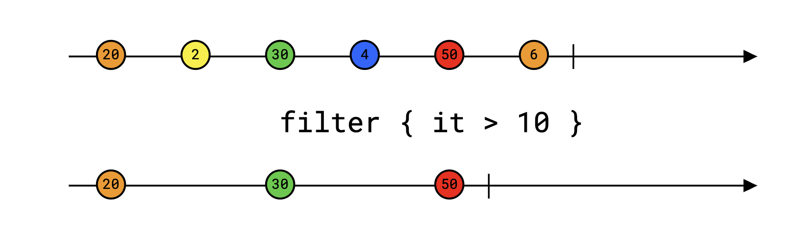

    Source:   --1--2--3--4--5--|

    |
    v

    Filter(x%2==0): --2-----4--|

    ### NOTES:
    The filter operator is used to emit only those values from the original flow that match a given predicate.
    Explanation:  
    - It takes a predicate function as a parameter.
    - Only values for which the predicate returns true are emitted downstream.

    ### Official Definition:

    ```kotlin
    inline fun <T> Flow<T>.filter(crossinline predicate: suspend (T) -> Boolean): Flow<T>
    ```
   
    Returns a flow containing only values of the original flow that match the given predicate.

    Example:

    ```kotlin
    fun main() = runBlocking {
        val numberFlow: Flow<Int> = flowOf(1, 2, 3, 4, 5)
        numberFlow
        .filter { it % 2 == 0 }
        .collect { println(it) } // Output: 2, 4
    }
    ```

    ## B. filterIsInstance

    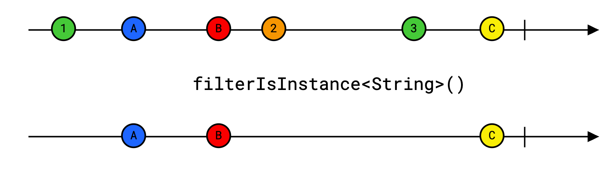

    Source:   --1--"a"--2.0--3--"b"--|

    |
    v

    filterIsInstance<Int>(): --1--------3------|

    ### NOTES:
    The filterIsInstance operator is used to emit only values that are instances of a specified type.  
    Explanation:  
    - Filters the flow to include only elements of a given type.
    - Useful for working with flows containing mixed types.

    ### Official Definition:

    ```kotlin
    inline fun <R> Flow<*>.filterIsInstance(): Flow<R>
    ```
   
    Returns a flow containing only values that are instances of specified type R.

    ```kotlin
    fun <R : Any> Flow<*>.filterIsInstance(klass: KClass<R>): Flow<R>
    ```
   
    Returns a flow containing only values that are instances of the given klass.

    Example:

    ```kotlin
    fun main() = runBlocking {
        val mixedFlow: Flow<Any> = flowOf(1, "a", 2.0, 3, "b")
        mixedFlow
        .filterIsInstance<Int>()
        .collect { println(it) } // Output: 1, 3
    }
    ```

    ## C. map

    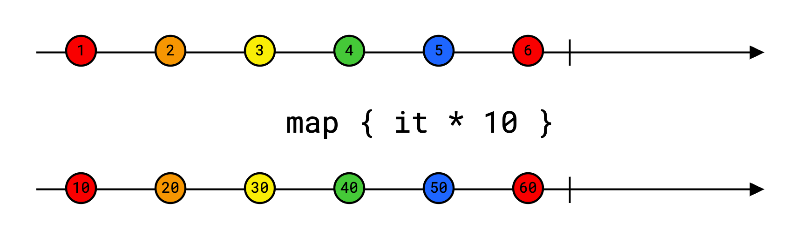

    Source:   --1--2--3--4--5--|

    |
    v

    Map(x*x): --1--4--9--16--25--|

    ### NOTES:
    The map operator is used to transform each value emitted by the original flow using a specified transformation function.
    Explanation:
    - It takes a transformation function as a parameter.
    - Each value from the original flow is transformed using this function before being emitted downstream.
    - Commonly used for data manipulation and conversion.
    - Supports suspending functions, allowing for asynchronous transformations.
   
    ### Official Definition:

    ```kotlin
    inline fun <T, R> Flow<T>.map(crossinline transform: suspend (value: T) -> R): Flow<R>
    ```

    Returns a flow containing the results of applying the given transform function to each value of the original flow.

    Example:

    ```kotlin
    fun main() = runBlocking {
        val numberFlow: Flow<Int> = flowOf(1, 2, 3, 4, 5)
        numberFlow
        .map { it * it }
        .collect { println(it) } // Output: 1, 4, 9, 16, 25
    }
    ```

    ## D. withIndex

    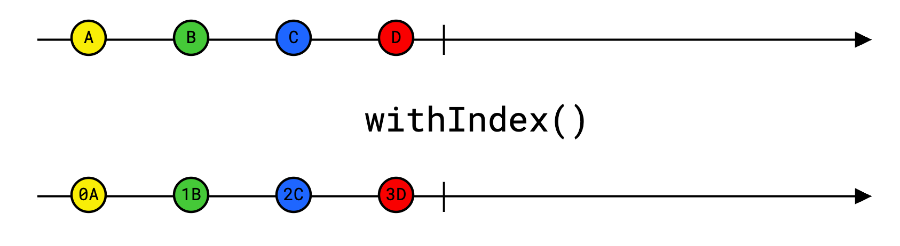

    Source:   --"a"--"b"--"c"--|

    |
    v

    withIndex(): --(0,"a")--(1,"b")--(2,"c")--|

    ### NOTES:
    The withIndex operator is used to wrap each element of the flow into an IndexedValue, which contains both the value and its index.
    Explanation:
    - It pairs each emitted value with its corresponding index.
    - Useful for scenarios where the position of elements matters.
    - The resulting flow emits IndexedValue objects.
    - Helps in tracking the order of elements in the flow.
   
    ### Official Definition:

    ```kotlin
    fun <T> Flow<T>.withIndex(): Flow<IndexedValue<T>>
    ```
    Returns a flow that wraps each element into IndexedValue, containing value and its index.

    Example:

    ```kotlin
    fun main() = runBlocking {
        val stringFlow: Flow<String> = flowOf("a", "b", "c")
        stringFlow
        .withIndex()
        .collect { println(it) } // Output: IndexedValue(index=0, value=a), IndexedValue(index=1, value=b), IndexedValue(index=2, value=c)
    }
    ```
   
    ## E. onEach

    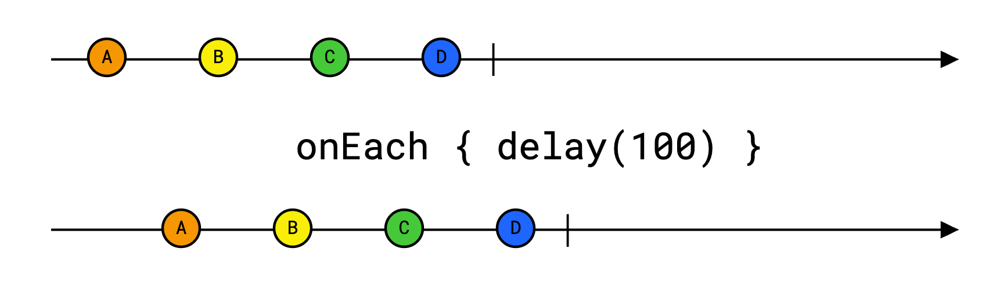

    Source:   --1--2--3--|

    |
    v

    onEach { println("Value: $it") }: --1--2--3--|

    ### NOTES:
    The onEach operator is used to perform side effects for each value emitted by the original flow without modifying the values themselves.
    Explanation:
    - It takes an action function as a parameter.
    - The action is invoked for each emitted value.
    - Commonly used for logging, debugging, or other side effects.
    - Does not alter the flow's data; values are passed through unchanged.
    - Helps in monitoring the flow's emissions.
    - Useful for debugging and logging purposes.
   
    ### Official Definition:

    ```kotlin
    fun <T> Flow<T>.onEach(action: suspend (T) -> Unit): Flow<T>
    ```

    Returns a flow that invokes the given action before each value of the upstream flow is emitted downstream.

    Example:

    ```kotlin
    fun main() = runBlocking {
      val numberFlow: Flow<Int> = flowOf(1, 2, 3)
      numberFlow
      .onEach { 
          // simulate some work
          delay(2000) 
          // Side effects (like logging) can occur for each item.
          println("Value: $it") 
      }
      .collect { println(it) } // Output: 1, 2, 3
    }
    ```

# 2. Zip Operators 
  - Zip operators are used to combine multiple flows into a single flow by pairing their emitted values 
    based on their emission order. Here is a commonly used zip operators in Kotlin Flow:

    ## A. zip [concurrent]

    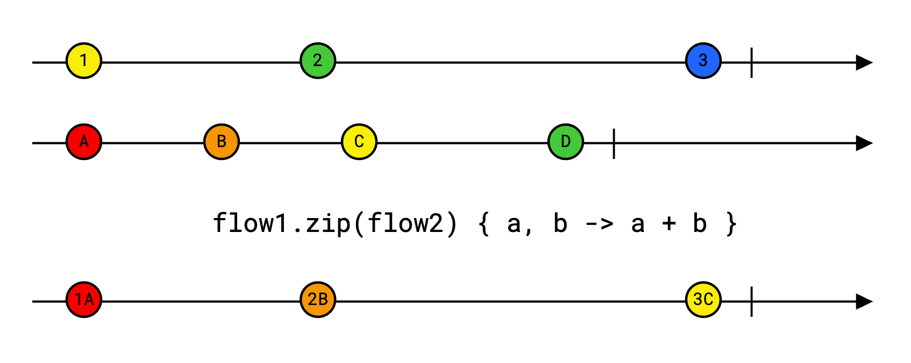

    -------------------------------------------------------------------------------------------------------

    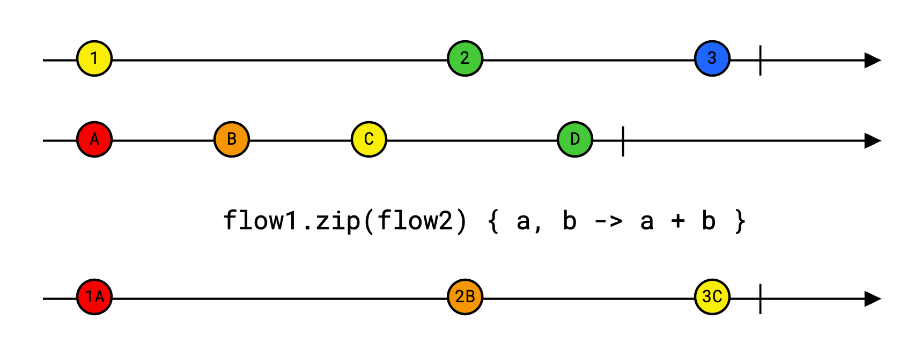

    Flow1:   --1-----2-----3--|

    Flow2:   ----A-----B-----C--|

    |
    v

    zip:    --[1,A]--[2,B]--[3,C]--|

    ### NOTES:
    The zip operator is used to combine two flows by pairing their emitted values based on their emission order.
    Zip will wait for both flows to emit value and then combine those values using the provided transform function.
    zip is used to execute the task in parallel and combine the results. 
    For example, execute multiple network calls in parallel.
    Explanation:
    - It takes another flow and a transformation function as parameters.
    - Pairs values from both flows using the provided transformation function.
    - The resulting flow emits values until one of the original flows completes.
    - Useful for combining related data streams.
    - Helps in synchronizing data from multiple sources.
    - Commonly used in scenarios where you need to combine data from two different flows.
    - The resulting flow completes as soon as one of the flows completes and cancel is called on the remaining flow.
    - If one flow emits more values than the other, the extra values are ignored.
    - The order of emissions is preserved based on the original flows.

    ### Use cases include:  
    - Synchronizing data from two sources (e.g., combining user IDs with user names).
    - Merging results from two parallel network/database calls.
    - Combining sensor data streams in real-time applications.

    ### Official Definition:

    ```kotlin
    fun <T1, T2, R> Flow<T1>.zip(other: Flow<T2>, transform: suspend (T1, T2) -> R): Flow<R>
    ```
   
    Combines values from this flow and another flow into pairs using the provided transform function.

    Zips (Combines) values from the current flow (this) with other flow using provided transform function applied to each pair of values. 
    The resulting flow completes as soon as one of the flows completes and cancel is called on the remaining flow.

    Example:

    ```kotlin
    fun main() = runBlocking {
        val flow1: Flow<Int> = flowOf(1, 2, 3)
        val flow2: Flow<String> = flowOf("A", "B", "C")
        flow1
        .zip(flow2) { a, b -> "[$a,$b]" }
        .collect { println(it) } // Output: [1,A], [2,B], [3,C]
    }
    ```

    The resulting flow completes as soon as one of the flows completes and cancel is called on the remaining flow.
    It can be demonstrated with the following example:

    ```kotlin
    fun main() = runBlocking {
        val flow1: Flow<Int> = flowOf(1, 2, 3).onEach { delay(10) }
        val flow2: Flow<String> = flowOf("A", "B", "C", "D").onEach { delay(15) }
        flow1
        .zip(flow2) { a, b -> "[$a,$b]" }
        .collect { println(it) } // Output: [1,A], [2,B], [3,C]
    }
    ```
   
# 3. Merge Operator
  - Here are some commonly used Merge operators in Kotlin Flow: 

    ## A. merge [concurrent]

    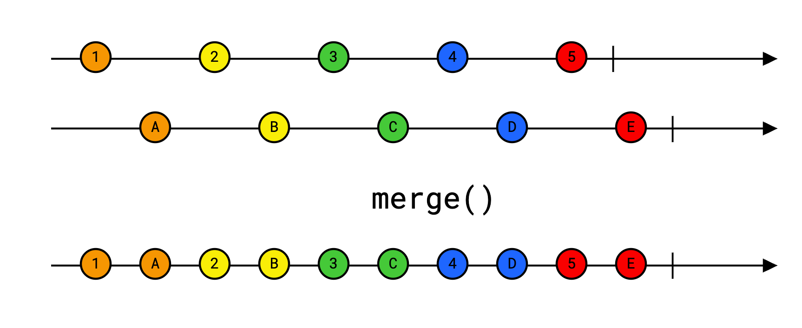

    -------------------------------------------------------------------------------------------------------

    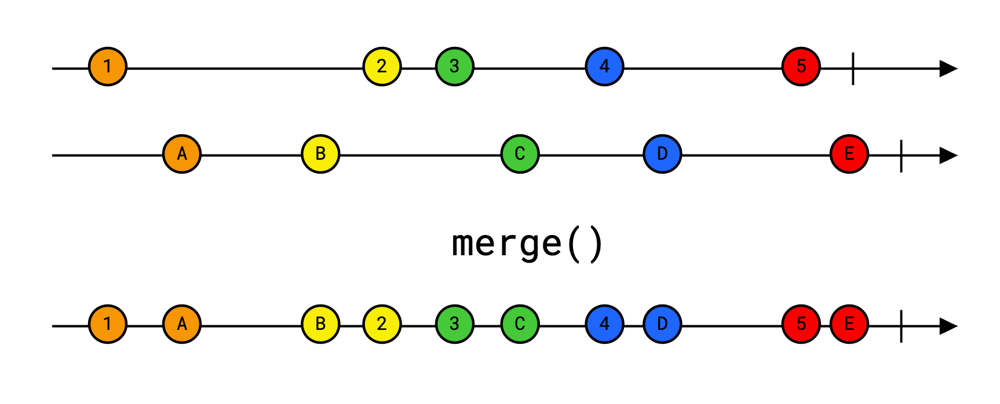

    -------------------------------------------------------------------------------------------------------

    

    ### NOTES:
    The merge operator is used to combine multiple flows into a single flow without preserving the order of elements.
    Explanation:
    - Merges multiple flows concurrently.
    - Merge will execute 2 parallel concurrent flows (one for outer and one for inner flow) and emit values as soon as they are emitted from any of the flow.
    - Does not guarantee the order of emitted values.
    
    ### Use cases include:
    - Combining data from multiple sensors in real-time applications.
    - Merging results from multiple parallel network/database calls that can be processed independently.
    - Handling multiple streams of data in reactive programming scenarios.

    ### Official Definition:

    ```kotlin
    fun <T> merge(vararg flows: Flow<T>): Flow<T>
    ```

    ```kotlin
    fun <T> Iterable<Flow<T>>.merge(): Flow<T>
    ```

    Merges the given flows into a single flow without preserving an order of elements. All flows are merged concurrently, without limit on the number of simultaneously collected flows.

    Operator fusion:
    Applications of flowOn, buffer, and produceIn after this operator are fused (combined) with its concurrent merging so that only one properly configured channel is used for execution of merging logic.
    -> This means that when you use operators like flowOn, buffer, or produceIn after merge (or similar concurrent operators), they are internally combined (fused) with the merging logic. 
    Instead of creating separate channels or buffers for each operator, Kotlin Flow optimizes them into a single channel. This improves performance and reduces overhead, 
    ensuring efficient concurrent merging and processing of flow emissions.

    Example:

    ```kotlin
    fun main() = runBlocking {
        val flow1: Flow<Int> = flowOf(1, 2, 3).onEach { delay(10) }
        val flow2: Flow<String> = flowOf("A", "B", "C").onEach { delay(15) }
        merge(flow1, flow2)
        .collect { println(it) } // Output: 1, A, 2, B, 3, C (order may vary)
    }
    ```
   
    ## B. flatMapConcat

    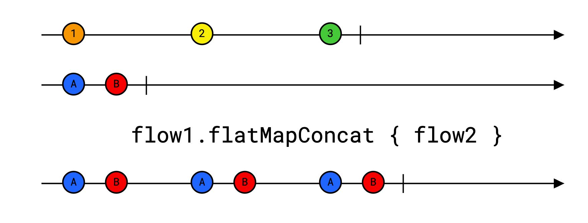

    -------------------------------------------------------------------------------------------------------

    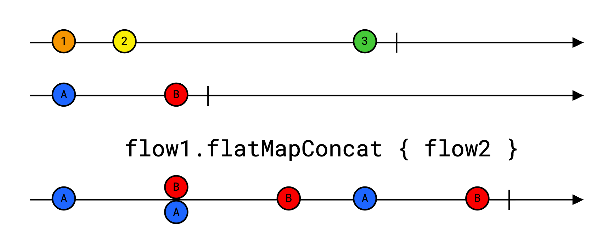

    ### NOTES:
    The flatMapConcat operator is like lining up tasks in a queue — each task starts only after the previous one completes.
    Explanation:
    - Runs inner flows sequentially (one after another).
    - This means each inner flow is collected one after another, preserving the order of emissions.
    - For example, execute multiple network calls in series.

    ### Use cases include:
    - Sequentially processing a series of dependent network calls.
    - Chaining database operations that depend on the results of previous operations.
    - Handling user interactions that require ordered processing of tasks.
    - Maintaining the order of emitted values from inner flows.
    - When you need to process multiple asynchronous tasks in a sequential manner and collect their results in order.
    - It works same as nested loop.

    ### Official Definition:

    ```kotlin
    @ExperimentalCoroutinesApi
    fun <T, R> Flow<T>.flatMapConcat(transform: suspend (value: T) -> Flow<R>): Flow<R>
    ```
    
    Transforms elements emitted by the original flow by applying transform, that returns another flow, and then concatenating and flattening these flows.
    This method is a shortcut for map(transform).flattenConcat().
    Note that even though this operator looks very familiar, we discourage its usage in a regular application-specific flows. Most likely, suspending operation in map operator will be sufficient and linear transformations are much easier to reason about.

    Example:

    ```kotlin
    @ExperimentalCoroutinesApi
    fun main() = runBlocking {
        val numberFlow: Flow<Int> = flowOf(1, 2, 3)
        numberFlow
        .flatMapConcat { number ->
            flow {
                emit(number * 10)
                delay(100)
                emit(number * 10 + 1)
            }
        }
        .collect { println(it) } // Output: 10, 11, 20, 21, 30, 31
    }
    ```
   
    ## C. flattenConcat

    Source:   -- Flow1 -- Flow2 -- Flow3 --|
    
    |
    v

    flattenConcat(): -- Flow1 values -- Flow2 values -- Flow3 values --|

    ### NOTES:
    The flattenConcat operator is used to flatten a flow of flows into a single flow by concatenating the inner flows sequentially.
    In case of 2 flows, first inner flow will be collected completely and after that only second inner flow will be collected.
    Explanation:
    - Emits values from each inner flow one after another, preserving the order of emissions.
    - Useful for scenarios where you have a flow that emits other flows and you want to process them in sequence.
    - It waits for each inner flow to complete before moving to the next, preserving the order.

    ### Use cases include:
    - Sequentially processing a series of dependent network calls.
    - flattenConcat is also used to execute the task in series, for example multiple network call in series.

    ### Official Definition:

    ```kotlin
    @ExperimentalCoroutinesApi
    fun <T> Flow<Flow<T>>.flattenConcat(): Flow<T>
    ```

    Flattens the given flow of flows into a single flow in a sequential manner, without interleaving nested flows.
    Inner flows are collected by this operator sequentially.

    Example:

    ```kotlin
    @ExperimentalCoroutinesApi
    fun main() = runBlocking {
        val flowOfFlows: Flow<Flow<Int>> = flowOf(
            flowOf(1, 2),
            flowOf(3, 4),
            flowOf(5, 6)
        )
        flowOfFlows
        .flattenConcat()
        .collect { println(it) } // Output: 1, 2, 3, 4, 5, 6
    }
    ```
   
    ## D. flatMapMerge [concurrent]

    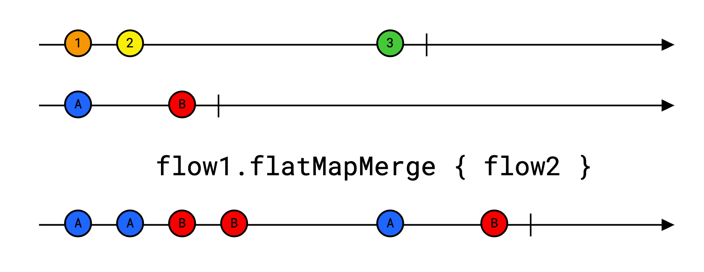

    -------------------------------------------------------------------------------------------------------

    

    ### NOTES:
    flatMapMerge will execute inner flows concurrently in parallel
    (for each outer flow emitted value, there will be one separate concurrent inner flow)
    and emit values as soon as they are emitted from any of the inner flow.
    FlatMapMerge introduces asynchronous operation, where each flow is started into a new coroutine scope so they can process parallel running tasks.
    This allows multiple inner flows to run in parallel, emitting their values as soon as they are available.
    Explanation:
    - It works same as parallel nested loop.
    - Runs inner flows concurrently (parallel execution).
    - Output order is not guaranteed.
    - Useful for parallelizing tasks like network calls. 

    ### Use cases include:
    When you need to process multiple asynchronous tasks in parallel and collect their results as soon as they are ready.

    ### Official Definition:

    ```kotlin
    @ExperimentalCoroutinesApi
    fun <T, R> Flow<T>.flatMapMerge(concurrency: Int = DEFAULT_CONCURRENCY, transform: suspend (value: T) -> Flow<R>): Flow<R>
    ```
   
    Transforms elements (each value) emitted by the original flow by applying transform, that returns another flow, and then merging and flattening these flows concurrently.
    This operator calls transform sequentially and then merges the resulting flows with a concurrency limit on the number of concurrently collected flows.
    This method is a shortcut for map(transform).flattenMerge(concurrency).

    Note that even though this operator looks very familiar, we discourage its usage in a regular application-specific flows. Most likely, suspending operation in map operator will be sufficient and linear transformations are much easier to reason about.

    Operator fusion
    Applications of flowOn, buffer, and produceIn after this operator are fused with its concurrent merging so that only one properly configured channel is used for execution of merging logic.

    Example:

    ```kotlin
    @ExperimentalCoroutinesApi
    fun main() = runBlocking {
        val numberFlow: Flow<Int> = flowOf(1, 2, 3)
        numberFlow
        .flatMapMerge { number ->
            flow {
                emit(number * 10)
                delay(100)
                emit(number * 10 + 1)
            }
        }
        .collect { println(it) } // Output: 10, 20, 30, 11, 21, 31 (order may vary)
    }
    ```
   
    ## E. flatMapLatest [concurrent]

    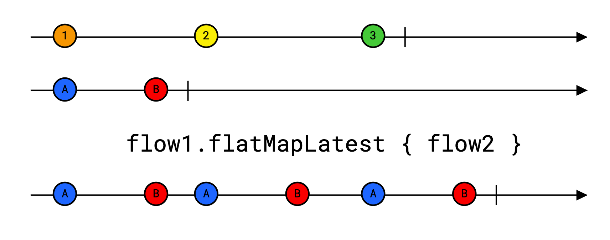

    -------------------------------------------------------------------------------------------------------

    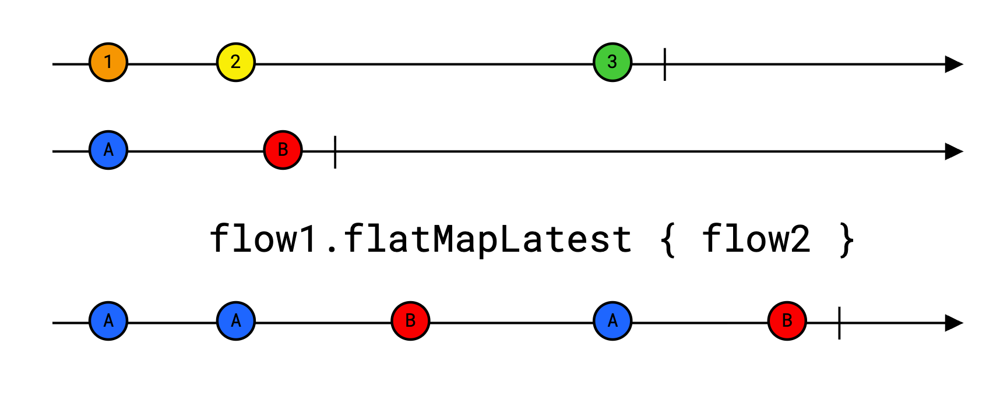

    ### NOTES:
    The flatMapLatest operator is used to transform each value emitted by the original flow into a new flow,
    but it only collects values from the most recently emitted inner flow.
    FlatMapLatest will cancel the previous inner flow and start new inner flow for each outer flow emit value.
    It forgets about the previous flow once a new one appears. With every new value, the previous flow processing is forgotten.
    Explanation:
    - Cancels the previous inner flow when a new value is emitted from the outer flow.
    - Only the latest inner flow's values are emitted downstream.
    - Useful for scenarios like search suggestions, where only the latest input matters.
    - Prevents outdated data from being processed.
    - Commonly used in scenarios where the latest data is more relevant than previous data.

    ### Use cases include:
    - Implementing search suggestions that update as the user types.
    - Handling user input that changes rapidly, such as in autocomplete features.

    ### Official Definition:

    ```kotlin
    @ExperimentalCoroutinesApi
    fun <T, R> Flow<T>.flatMapLatest(transform: suspend (value: T) -> Flow<R>): Flow<R>
    ```

    Returns a flow that switches to a new flow produced by transform function every time the original flow emits a value. 
    When the original flow emits a new value, the previous flow produced by transform block is cancelled.
    
    Example:

    ```kotlin
    @ExperimentalCoroutinesApi
    fun main() = runBlocking {
        val numberFlow: Flow<Int> = flowOf(1, 2, 3)
        numberFlow
        .flatMapLatest { number ->
            flow {
                emit(number * 10)
                delay(100)
                emit(number * 10 + 1)
            }
        }
        .collect { println(it) } // Output: 10, 20, 30, 31
    }
    ```

# 4. Emitters Operators
  - Here are some commonly used transform operators in Kotlin Flow:
    
    ## A. transform

    


